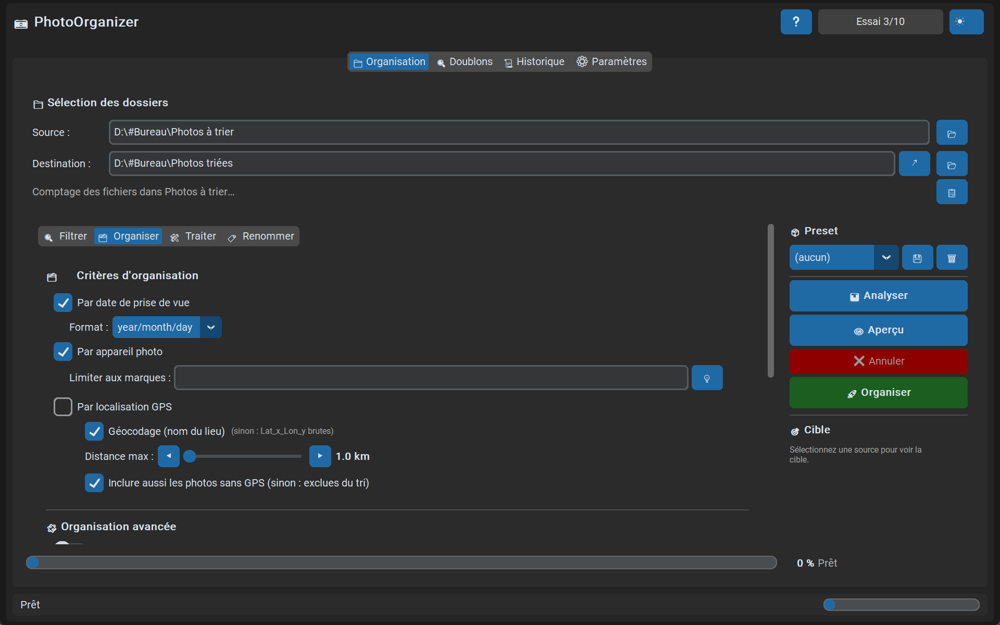

# PhotoOrganizer

> Trie automatiquement des milliers de photos par date, appareil et GPS — application Windows, sans installation, gratuite.

[](https://www.python.org/)
[](LICENSE)
[](https://github.com/Kiriiaq/PhotoOrganizer/releases)
[](https://github.com/Kiriiaq/PhotoOrganizer/releases)
[](https://github.com/Kiriiaq/PhotoOrganizer/actions/workflows/ci.yml)
[](#tests)

[Télécharger l'EXE Windows](https://github.com/Kiriiaq/PhotoOrganizer/releases) · [Documentation](docs/) · [Soutenir sur Ko-fi](https://ko-fi.com/kiriiaq)

---

## Démo

> 
>
> *Capture à produire — voir [docs/MEDIA.md](docs/MEDIA.md) pour la liste complète des visuels à enregistrer.*

---

## Installation

### Windows (recommandé)

1. Télécharger `PhotoOrganizer-X.Y.Z.exe` depuis la [page Releases](https://github.com/Kiriiaq/PhotoOrganizer/releases).
2. Double-cliquer. Pas d'installation, pas de dépendances. Defender peut demander une confirmation au premier lancement (binaire non signé).

### Depuis les sources

```bash
git clone https://github.com/Kiriiaq/PhotoOrganizer.git
cd PhotoOrganizer
pip install -e ".[dev]"
python main.py
```

Python 3.11+ requis. Pour le drag-and-drop et les notifications Windows, installer les extras :

```bash
pip install -e ".[dev,dnd,toast]"
```

---

## Usage en 30 secondes

1. **Onglet "Organisation"** : sélectionner un dossier source et un dossier destination.
2. Choisir un ou plusieurs critères : **date**, **appareil**, **lieu GPS** (cumulables).
3. *(Optionnel)* renommer via template `{date:%Y-%m-%d}_{model}_{counter:04d}`.
4. Cliquer **"Organiser"**. Suivi en temps réel, annulation possible à tout moment.
5. Onglet **"Historique"** : annuler la dernière opération si besoin (rollback complet par session).

Aucun fichier n'est modifié sans confirmation. Le mode "copier" est sélectionné par défaut.

---

## Fonctionnalités

- **45 formats** : JPEG, PNG, GIF, BMP, TIFF, WebP, HEIC/HEIF, RAW (CR2, CR3, NEF, RW2, ARW, DNG, ORF…), vidéos (MP4, MOV, AVI, MKV…).
- **Organisation multi-critères** : date, modèle d'appareil, coordonnées GPS, ou combinaison hiérarchique (ex. *Date > Appareil > Lieu*).
- **Templates de renommage** personnalisables (variables date, compteur, modèle, dimensions).
- **Détection de doublons** multi-algorithme (MD5, SHA-1, Blake3 si dispo) avec scan parallèle.
- **Quarantaine réversible** pour la suppression des doublons (recyclable, pas d'aller simple).
- **Historique avec rollback** par session — annulation propre, recréation des dossiers vidés.
- **Cache 2-niveaux** (RAM + SQLite) pour les métadonnées EXIF — relancer un scan reste rapide.
- **Géocodage inverse** optionnel via OpenStreetMap Nominatim (peut être désactivé).
- **Drag-and-drop** des dossiers (si `tkinterdnd2` installé).
- **Toasts Windows** pour les opérations longues (si `plyer` installé).
- **Mode sombre/clair** avec détection système automatique.
- **Raccourcis clavier** Ctrl+1..4 pour naviguer entre onglets.

---

## Architecture

Voir [docs/ARCHITECTURE.md](docs/ARCHITECTURE.md) pour la carte des modules, les couches (UI / core / utils) et les flux principaux.

Vue rapide :

```
main.py → src/main:main → src/ui/app:PhotoOrganizerApp
                                  ├── frames/organize_frame    ← onglet principal
                                  ├── frames/duplicates_frame
                                  ├── frames/history_frame
                                  └── frames/settings_frame
                                          │
                                          ▼
                              src/core/{operations, metadata}
                                          │
                                          ▼
                              src/utils/{cache, hash_cache, config, logger}
```

---

## Tests

```bash
make test        # 207 tests, exécution ~20 s
make test-all    # + slow + benchmarks
make lint        # ruff + bandit
make bench       # benchmarks isolés
```

Suite organisée en 5 catégories : `smoke/`, `functional/`, `perf/`, `stress/`, `volume/`. Couverture ~70 % sur les modules métier.

---

## Build de l'exécutable

```bash
python build.py            # release windowed (~37 MB onefile)
python build.py --debug    # debug + console
python build.py --light    # variante minimale (suppose Python sur la cible)
```

Une optimisation taille `.exe` (cible 22 MB, −40 %) est documentée dans [docs/exe-optimization.md](docs/exe-optimization.md).

---

## Roadmap

| Phase | Sujet | Statut |
|---|---|---|
| **v2.3** | Refonte panneau Organisation + flow trial+unlock (10 tris gratuits / 10 € lifetime) | 🟦 en cours sur `feat/v2.3-organize-tabview` |
| **v2.4** | Optimisation taille `.exe` (37 → 22 MB) | ⬜ Plan dans [docs/exe-optimization.md](docs/exe-optimization.md) |
| **v3.0** (conditionnel) | Add-on optionnel : batch CLI + watch-folder + plugins (gelé pour l'instant) | ⬜ Réactivation si la v2.3 trouve sa traction |

---

## Modèle économique

PhotoOrganizer adopte un modèle **trial + unlock** (type Sublime Text / WinRAR) :

- **Code source** sous **Apache-2.0** — usage libre, modification autorisée, redistribution OK.
- **Application binaire** distribuée avec **10 tris d'essai gratuits**. Au-delà, déblocage par clé à **10 € lifetime, 1 PC** (clé liée au premier ordinateur qui l'active).
- **Toutes les mises à jour futures incluses** — pas d'abonnement, pas de version "Pro+", pas de paywall sur des fonctionnalités.
- **Aucune réémission** en cas de changement de PC, réinstallation Windows, ou disque mort — politique stricte assumée au prix de 10 €.

Stratégie détaillée + flow technique : [docs/MONETIZATION.md](docs/MONETIZATION.md). Procédure pas-à-pas : [NEXT_STEPS.html](docs/NEXT_STEPS.html).

---

## Contribuer

Les contributions sont les bienvenues. Lire [CONTRIBUTING.md](CONTRIBUTING.md) avant d'ouvrir une PR.

Pour signaler un bug, ouvrir une [issue GitHub](https://github.com/Kiriiaq/PhotoOrganizer/issues) avec :

- description courte,
- étapes de reproduction,
- comportement attendu vs observé,
- version Python + OS (`python --version`, `winver`).

Vulnérabilité de sécurité → lire [SECURITY.md](SECURITY.md) **avant** d'ouvrir une issue publique.

---

## License

[Apache License 2.0](LICENSE) — usage libre (commercial ou personnel), modifications autorisées, attribution requise. Copyright 2025-2026 Kiriiaq (Emmanuel Grolleau).

---

## Crédits

- [CustomTkinter](https://github.com/TomSchimansky/CustomTkinter) — toolkit UI moderne pour Tkinter
- [ExifRead](https://github.com/ianare/exif-py) — lecture EXIF
- [Pillow](https://python-pillow.org/) — traitement d'image
- [pillow-heif](https://github.com/bigcat88/pillow_heif) — support HEIC/HEIF
- [PyInstaller](https://pyinstaller.org/) — packaging Windows
- [OpenStreetMap Nominatim](https://nominatim.openstreetmap.org/) — géocodage inverse

---

## Contact

- **Auteur** : Kiriiaq (Emmanuel Grolleau)
- **Email** : manugrolleau48@gmail.com
- **Ko-fi** : [ko-fi.com/kiriiaq](https://ko-fi.com/kiriiaq)
- **Repo** : [github.com/Kiriiaq/PhotoOrganizer](https://github.com/Kiriiaq/PhotoOrganizer)
